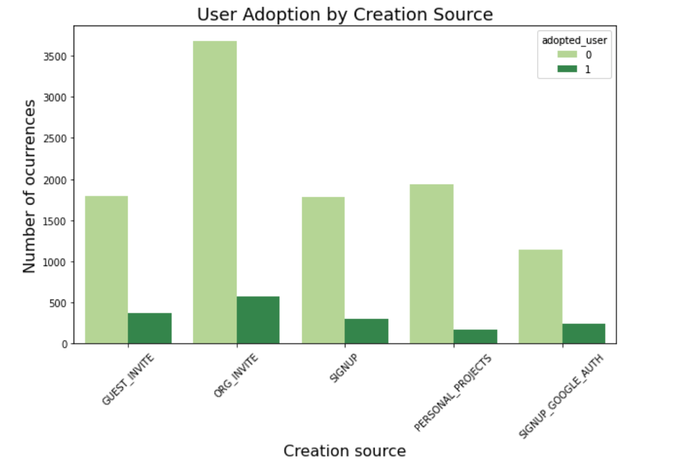
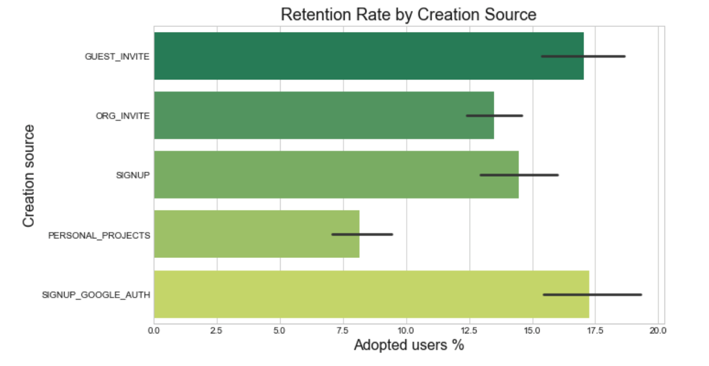
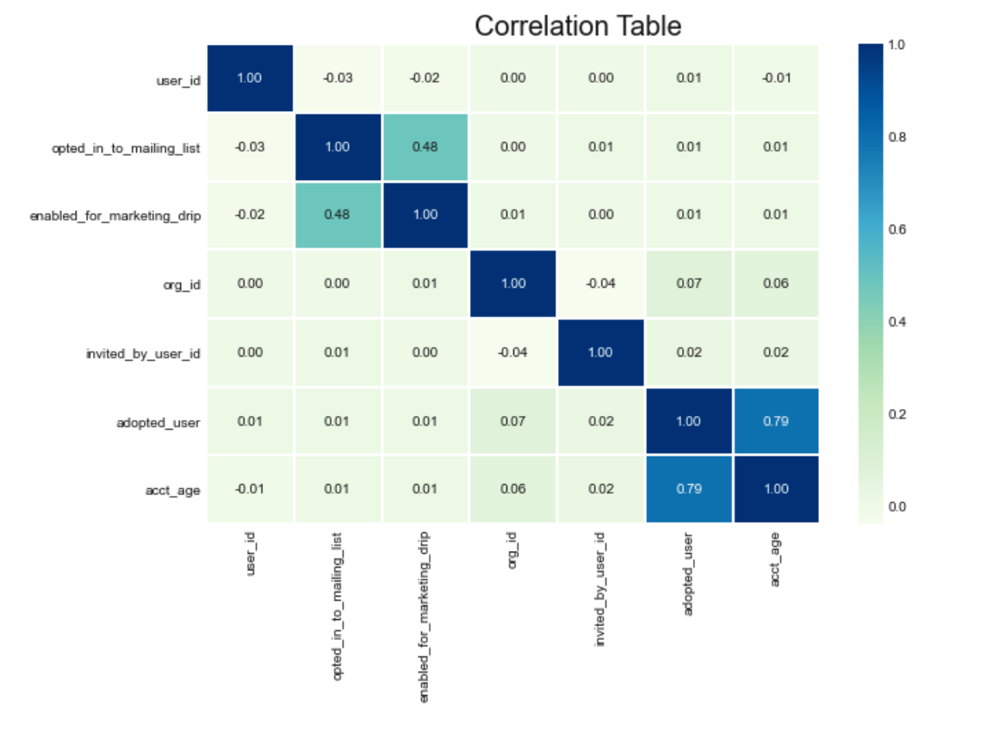
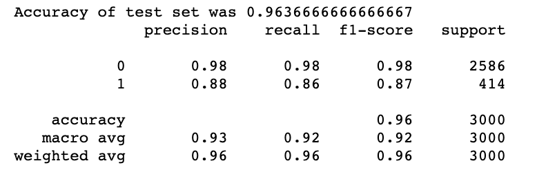
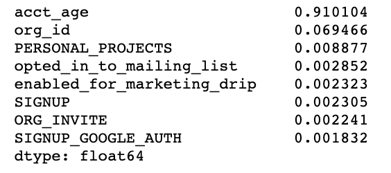

## RELAX INC - Data Science Challenge

Relax Inc. makes productivity and project management software that's popular with both individuals and teams. Founded by several former Facebook employees.

# Predict Future User Adoption

**Exploratory data analysis:**
- Creation source seems to be a good predictor of retention rate. 
- The features SIGNUP_GOOGLE_AUTH and GUEST_INVITE show a higher rate of adopted users compared to the other sources. 
- The lowest retention rate is for users who sign up for personal projects. 
- A chi-square confirms an association between creation_source and adopted_users with a p-value < 0.05.

**Predictive Modeling:** 
- Running a Random Forest Classifier with the original features returned a 0.72 test accuracy. 

**Feature Engineering:**
- The first correlation heatmap showed a correlation between the target variable (adopted_user) and last_session_creation_time. 
- Created a feature called acct_age.
- New feature has the age of each account.
  - subtract to find time:
    - users['acct_age'] = users['last_session_creation_time'] - users['creation_time']
  - convert timedelta64[ns] to int:
    - users['acct_age'] = users['acct_age'].dt.components.days
- It has a high correlation (0.79) with adopted_user.

**Predictive Modeling with new feature:**
- **Random Forest Classifier test accuracy 0.96**.
- The most important feature to predict user adoption is the engineered feature acct_age.
- Second most important is org_id. 
- The engineered feature significantly improved model performance.

**Table 1. PRECISION RECALL**

**Table 2. FEATURE IMPORTANCE**

**Next steps:** 
- Further explore org_id, perhaps apply KNN clustering algorithm to identify the natural grouping of users and create new features based on it. 
- Apply other classification algorithms such as logistic regression, decision tree and gradient boosting.
